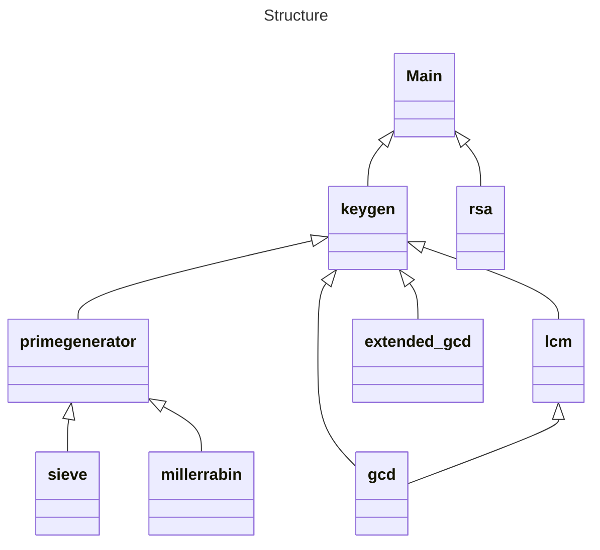
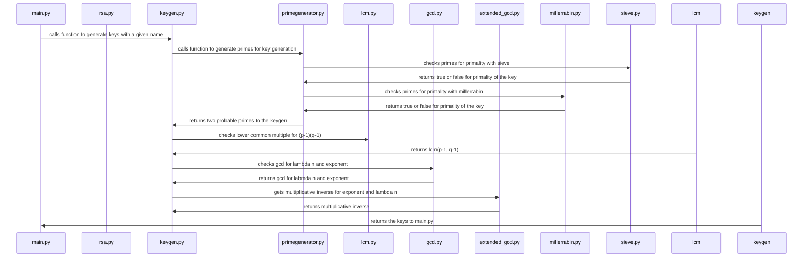
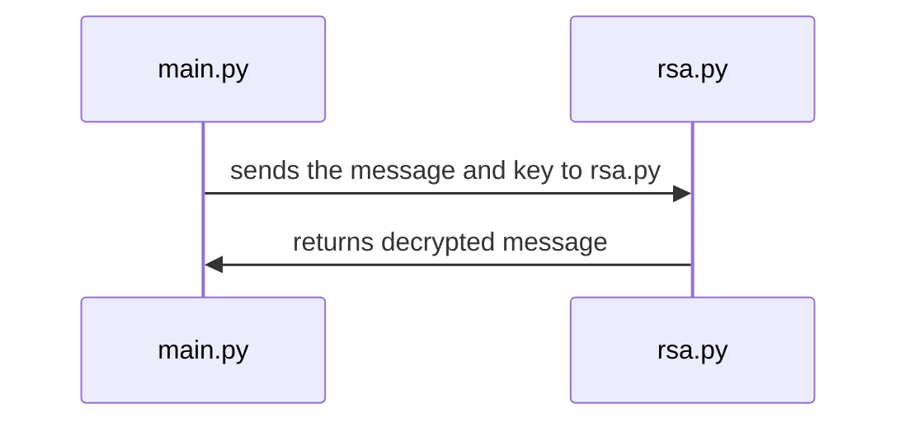

# Implementation document

## Structure of the program

## How the program functions
### Generation of keys

### Encryption of a message

### Decryption of a message

## Implemented functions

### Greatest common divisor
Filename: gcd.py

Greatest common divisor is achieved by completing the Euclidean algortihm

Time complexity: O(N)

Source for time complexcity: https://www.geeksforgeeks.org/time-complexity-of-euclidean-algorithm/

### Extended GCD (Extended euclidean algorithm)
Filename: extended_gcd.py

Extended gcd is also the euclidean algorithm while keeping different data saved.

Time complexity: O(N)

### Lowest common multiple
Filename: lcm.py

Also uses gcd and thus the euclidean algorithm

Time complexity: O(N)

### Sieve of Eratosthenes
Filename: sieve.py

Time complexity: O(n log log n)

Source for time complexity: https://en.wikipedia.org/wiki/Sieve_of_Eratosthenes#Algorithmic_complexity

### Miller-Rabin primality test
Filename: millerrabin.py

Time complexity: O(k log^3 n)

Source for time complexity: https://en.wikipedia.org/wiki/Miller%E2%80%93Rabin_primality_test#Complexity

### Prime generation
Filename: primegenerator.py

Slowest function it uses is the miller-rabin primality test and as such it's complexity is O(k log^3 n)

Time complexity: O(k log^3 n)

### Key generation
Filename: keygen.py

Slowest function is uses is the prime generation and as such it has same time complexity as it does.

Time complexity: O(k log^3 n)

### RSA Encryption and Decryption
Filename: rsa.py

Time complexity: O(log N)

Source for time complexity: https://www.geeksforgeeks.org/modular-exponentiation-python/

## Flaws and potential improvements
- Currently biggest flaw is lack of dependency injection making testing somewhat complicated with randomness-related functions.
- Easy ways to improve would to make the messages get encoded with ascii or base64 or some other way so the messages can be text instead of exclusively numbers.

## Usage of LLMs (Large Language Models)

- No LLMs were used at any phase while making the program.

## References
https://en.wikipedia.org/wiki/RSA_(cryptosystem)

https://en.wikipedia.org/wiki/Least_common_multiple

https://en.wikipedia.org/wiki/Extended_Euclidean_algorithm

https://en.wikipedia.org/wiki/Sieve_of_Eratosthenes

https://en.wikipedia.org/wiki/Miller%E2%80%93Rabin_primality_test
