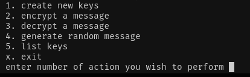

# User manual

## Installing

Clone the repository with following command

> git clone https://github.com/Jlukka/algolabra2024.git

Change directory to the root directory and run following commands to install dependencies

> poetry install

## Terminal commands

To launch the program use following command

> poetry run invoke start

To run the tests associated with the code use following command

> poetry run invoke test

To generate a coverage report of the tests use following command

> poetry run invoke coverage

To create html version of the coverage report use following command

> poetry run invoke coverage-report

To generate a pylint report on the code run following command

> poetry run invoke lint

To automatically format the code with autopep8 run the following command

> poetry run invoke format

## Using the user interface

Operating the interface happens through writing in the terminal
The commands are as follows
1 - Create new keys, allows you to name a pair of keys (private and public)
2 - Encrypt a message, allows you to encrypt a message by first entering a message and then the key you wish to use for the encryption
3 - Decrypt a message, allows you to decrypt a message by first entering a message and then the key you wish to use for the decryption
4 - Generate a random message allows you to generate a random message of specified length
5 - List keys lists all keys that have been created, both public and private.
x - Exits the program 