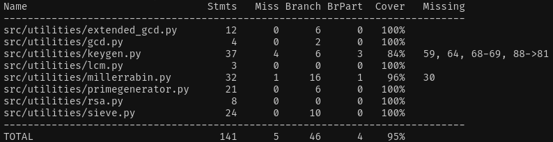

# Testing documentation

## Testing coverage

Coverage is overall 95%, most files at 100% but some falling below the 100% mostly due to conditions that might never be fulfilled depending on RNG

## How to run the tests

Simply write in poetry shell 
> poetry run invoke test

To generate the coverage report again simply write
> poetry run invoke coverage

and to view the coverage report either write

> coverage report -m

to view it in terminal or write

> poetry run invoke coverage-report

which will create the html version of the coverage report which will be openable in your browser.

## What was tested and how

### Greatest common divisor
Filename: gcd.py

Coverage: 100%

The function was tested with both very small and realistically big (~1000 bit numbers)
Expected values for the tests were gotten from https://www.dcode.fr/gcd

### Extended GCD (Extended euclidean algorithm)
Filename: extended_gcd.py

Coverage: 100%

The function was tested with both very small and realistically big (~1000 bit numbers)
Expected values for the tests were gotten from https://www.dcode.fr/modular-inverse

### Lowest common multiple
Filename: lcm.py

Coverage: 100%

The function was tested with both very small and realistically big (~1000 bit numbers)
Expected values for the tests were gotten from https://www.dcode.fr/lcm

### Sieve of Eratosthenes
Filename: sieve.py

Coverage: 100%

Tested both a small and a large sieve with known compound and known prime numbers. It was also checked that the lists generated by the sieves include the exact primes they should.
Small sieve was every prime under 500 and large prime was every prime under 10000.

For the small sieve the list of primes were taken from https://prime-numbers.info/list/first-500-primes. For the small sieve the compound number was simply 449*467 and the known prime was 199933 and the number was taken from https://en.wikipedia.org/wiki/List_of_prime_numbers

For the large sieve the list of primes were taken from https://jalu.ch/coding/primes/list.php. For the large sieve the compound number was 2^1022 which as a power of 2 is obviously a compound number. The prime was selected as the M1279 mersenne prime (2**1279)-1 from https://en.wikipedia.org/wiki/Largest_known_prime_number

### Miller-Rabin primality test
Filename: millerrabin.py

Coverage: 96%

The tests test the miller rabin primality test with a number of known primes and known composites to test whether it works with all sizes of inputs.For small values the tests are 719(prime) and 1024 (composite), 719 as a prime number was fetched from https://en.wikipedia.org/wiki/List_of_prime_numbers. For moderate values the composite number of 8683317618811886495518194401279999999^2 gets tested, 8683317618811886495518194401279999999 being a prime fetched from https://en.wikipedia.org/wiki/List_of_prime_numbers. For larger values the known prime being tested is again M1279 mersenne prime from https://en.wikipedia.org/wiki/List_of_prime_numbers. The compound number in this case is M1279 multiplied by M607. The largest numbers exceed numbers normally used by the program so the functionality of the program should be sound aslong as the tests pass.

For miller rabin I've opted to a private function within the class to ensure it functions correctly and while it's not directly needed to be visible to any other class since it doesn't rely on other tested functions I figured it'd be important to ensure it functions correctly. The function to find d and s I couldn't find large values for it so I have to opt to test it with small numbers I could find. First example is from https://en.wikipedia.org/wiki/Miller%E2%80%93Rabin_primality_test. The second example is from https://homepages.math.uic.edu/~leon/mcs425-s08/handouts/Rabin-Miller-Examples.pdf 

### Prime generation
Filename: primegenerator.py

Coverage: 100%

Testing for primegenerator.py is rather light and I only test whether it returns a number of correct bit length. As the prime generation function relies on the correctness of both the Sieve of Eratosthenes and Miller-Rabin testing the numbers with those functions would not provide any value so I've installed a 3rd party library providing rabin tests to test primes I've generated with. Library also provided sieve of eratosthenes but it wouldn't accept large enough numbers.

### Key generation
Filename: keygen.py

Coverage: 84%

As with prime generation the testing for the public methods is quite light since there isn't much testing that I can do with them, however on top of this like in miller-rabin I will test the private methods "check_too_close" and "check_lambda_n" underneath to ensure they are working correctly since they likewise aren't based off of other tested methods. Large primes used to test the functions were gotten from https://en.wikipedia.org/wiki/List_of_prime_numbers

### RSA Encryption and Decryption
Filename: rsa.py

Coverage: 100%

Tests essentially end-to-end test the entire program (with the exception of the UI) by encrypting both a very small and a realistically large number using the implementation of RSA. The tests check that a message encrypted is not equal to the original message, they also test that the same key cannot decrypt the encrypted message but the corresponding private/public key is required depending on which one was used for the encryption. Due to how RSA works a message encrypted using a private key is decryptable with the corresponding public key.

## Notes

In hindsight some of the methods I've written which have heavy RNG involvement I could've written the functions in such a way where I make the RNG generators dependencies and inject them into the classes as I could've easily made mock classes to test any wanted cases if I had done so. If I had had more time this would've been something to focus on.